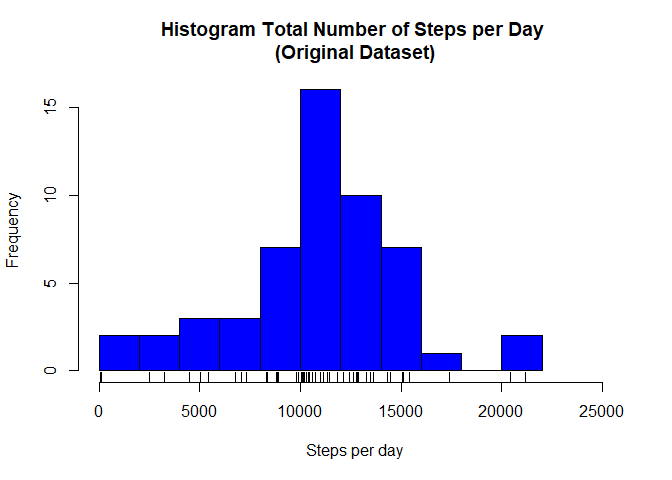
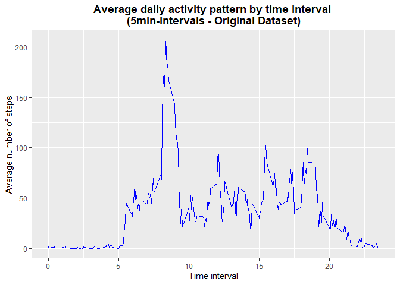
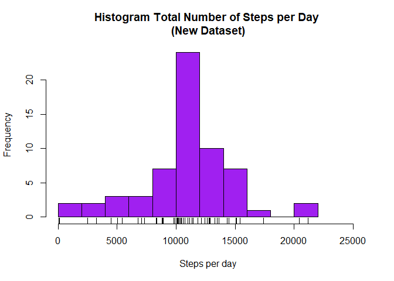
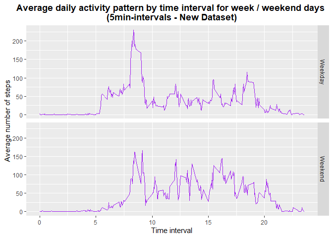

## Introduction
The objective of this assignment is to analyse data about the movement from an anonymous individual collected using an activity monitory device like Fitbit.
Detailed instructions to this assignment are available in the [README.md](https://github.com/RAGNIMY1/RepData_PeerAssessment1/blob/master/README.md) file.

## Setting the environment

```r
setwd("C:/RAGNIMY1/datasciencecoursera/RepData_PeerAssessment1") #### Change the working directory accordingly
rm(list = ls())
Sys.setlocale("LC_TIME", "English")
library(ggplot2)
library(tidyr)
library(dplyr)
```

```
## 
## Attaching package: 'dplyr'
```

```
## The following objects are masked from 'package:stats':
## 
##     filter, lag
```

```
## The following objects are masked from 'package:base':
## 
##     intersect, setdiff, setequal, union
```
## Loading and preprocessing the data
Note: the forked GitHub repository created for the assignment does already contain the activity monitoring dataset (activity.zip file) 

```r
DataFileZip <- "activity.zip"
DataFile <- "activity.csv"
if (!file.exists(DataFile)){ 
        unzip(DataFileZip) 
} 
if (!dir.exists("figure")){ 
        dir.create("figure") 
} 
Activity <- read.csv(DataFile,stringsAsFactors = FALSE)
Activity$date <- as.Date(Activity$date)
#### Data Structure
str(Activity)
```

```
## 'data.frame':	17568 obs. of  3 variables:
##  $ steps   : int  NA NA NA NA NA NA NA NA NA NA ...
##  $ date    : Date, format: "2012-10-01" "2012-10-01" ...
##  $ interval: int  0 5 10 15 20 25 30 35 40 45 ...
```

```r
head(Activity, n=10)
```

```
##    steps       date interval
## 1     NA 2012-10-01        0
## 2     NA 2012-10-01        5
## 3     NA 2012-10-01       10
## 4     NA 2012-10-01       15
## 5     NA 2012-10-01       20
## 6     NA 2012-10-01       25
## 7     NA 2012-10-01       30
## 8     NA 2012-10-01       35
## 9     NA 2012-10-01       40
## 10    NA 2012-10-01       45
```

The variables included in this dataset are:  
* **steps**: Number of steps taking in a 5-minute interval (missing values are coded as NA)  
* **date**: The date on which the measurement was taken in YYYY-MM-DD format  
* **interval**: Identifier for the 5-minute interval in which measurement was taken  

## What is mean total number of steps taken per day?
**Step1**: Calculate the total number of steps per day

```r
StepsPerDay <- Activity %>% 
        group_by(date) %>% 
        summarise(DaySteps = sum(steps))
head(StepsPerDay, n=10) 
```

```
## # A tibble: 10 x 2
##    date       DaySteps
##    <date>        <int>
##  1 2012-10-01       NA
##  2 2012-10-02      126
##  3 2012-10-03    11352
##  4 2012-10-04    12116
##  5 2012-10-05    13294
##  6 2012-10-06    15420
##  7 2012-10-07    11015
##  8 2012-10-08       NA
##  9 2012-10-09    12811
## 10 2012-10-10     9900
```

**Step2**: Represent the total number of steps taken each day on a Histogram  
Note: the histogram is stored in the *plot1.png* file in the subdirectory *figure*. 


```r
with(StepsPerDay,hist(DaySteps, nclass= 10, col="blue", xlim=c(0,1.2*max(DaySteps, na.rm=TRUE)),xlab="Steps per day", main="Histogram Total Number of Steps per Day \n(Original Dataset)"))
rug(StepsPerDay$DaySteps)
```

<!-- -->

```r
dev.copy(png,filename="figure/plot1.png", width=500, height=500)
```

```
## png 
##   3
```

```r
dev.off()
```

```
## png 
##   2
```

**Step3**: Calculate the mean and median total number of steps per day

```r
MeanStepsOri <- mean(StepsPerDay$DaySteps, na.rm=TRUE)
```
The mean of the total number of steps taken per day considering the original dataset is **1.0766189\times 10^{4}**.


```r
MedianStepsOri<- median(StepsPerDay$DaySteps,na.rm=TRUE)
```
The median of the total number of steps taken per day considering the original dataset is **10765**.

Comparing with the Mean/Median values provided by the summary function:


```r
summary(StepsPerDay$DaySteps)
```

```
##    Min. 1st Qu.  Median    Mean 3rd Qu.    Max.    NA's 
##      41    8841   10765   10766   13294   21194       8
```


## What is the average daily activity pattern?
**Step1**: On a time series plot of the 5-minute interval, show the average number of steps taken, averaged across all days  
Note: the histogram is stored in the *plot2.png* file in the subdirectory *figure*. 


```r
MeanPerInterval <- Activity %>% 
        group_by(interval) %>% 
        summarise(MeanSteps = mean(steps,na.rm=TRUE)) 
MeanPerInterval
```

```
## # A tibble: 288 x 2
##    interval MeanSteps
##       <int>     <dbl>
##  1        0    1.72  
##  2        5    0.340 
##  3       10    0.132 
##  4       15    0.151 
##  5       20    0.0755
##  6       25    2.09  
##  7       30    0.528 
##  8       35    0.868 
##  9       40    0     
## 10       45    1.47  
## # ... with 278 more rows
```

```r
graph <- ggplot(MeanPerInterval,aes(x=interval/100,y=MeanSteps))

graph + geom_line(col="blue") + 
        theme(plot.title = element_text(hjust = 0.5, face="bold")) +
        ggtitle("Average daily activity pattern by time interval \n(5min-intervals - Original Dataset)") +
        labs(x = "Time interval", y = "Average number of steps")
```

<!-- -->

```r
dev.copy(png,filename="figure/plot2.png", width=500, height=500)
```

```
## png 
##   3
```

```r
dev.off()
```

```
## png 
##   2
```

**Step2**: Identify Which 5-minute interval, on average across all the days in the dataset, contains the maximum number of steps

```r
idxmaxsteps <- which.max(MeanPerInterval$MeanSteps)
```
The interval, on average across all the days, which contains the maximum number of steps is the interval **835**.

## Imputing missing values
The purpose is to impute missing values as these may introduce bias into some calculations or summaries of data. Through the next steps we will check if missing values have a significant impact or not.

**Step1**: Calculate the number of days/intervals where there are missing values

```r
print(sum(is.na(Activity)))
```

```
## [1] 2304
```
**Step2**: Create a new dataset by replacing the missing values (in the steps variable) with the mean calculated for the corresponding 5-minute interval


```r
ActivityNew <- Activity 
for (i in 1:nrow(ActivityNew)) {
        if(is.na(ActivityNew[i,1])) {
              ActivityNew[i,1] <- round(MeanPerInterval[MeanPerInterval$interval == ActivityNew[i,]$interval,2],digit=2)
        }
}
head(ActivityNew, n=10)
```

```
##    steps       date interval
## 1   1.72 2012-10-01        0
## 2   0.34 2012-10-01        5
## 3   0.13 2012-10-01       10
## 4   0.15 2012-10-01       15
## 5   0.08 2012-10-01       20
## 6   2.09 2012-10-01       25
## 7   0.53 2012-10-01       30
## 8   0.87 2012-10-01       35
## 9   0.00 2012-10-01       40
## 10  1.47 2012-10-01       45
```

**Step3**: For the new dataset (no NA values), calculate the total number of steps per day

```r
StepsPerDayNew <- ActivityNew %>% 
        group_by(date) %>% 
        summarise(DaySteps = sum(steps))
head(StepsPerDayNew, n=10) 
```

```
## # A tibble: 10 x 2
##    date       DaySteps
##    <date>        <dbl>
##  1 2012-10-01   10766.
##  2 2012-10-02     126 
##  3 2012-10-03   11352 
##  4 2012-10-04   12116 
##  5 2012-10-05   13294 
##  6 2012-10-06   15420 
##  7 2012-10-07   11015 
##  8 2012-10-08   10766.
##  9 2012-10-09   12811 
## 10 2012-10-10    9900
```

**Step4**: For the new dataset (no NA values), represent the total number of steps taken each day on a Histogram  
Note: the histogram is stored in the *plot3.png* file in the subdirectory *figure*. 


```r
with(StepsPerDayNew,hist(DaySteps, nclass= 10, col="purple", xlim=c(0,1.2*max(DaySteps, na.rm=TRUE)),xlab="Steps per day", main="Histogram Total Number of Steps per Day \n(New Dataset)"))
rug(StepsPerDayNew$DaySteps)
```

<!-- -->

```r
dev.copy(png,filename="figure/plot3.png", width=500, height=500)
```

```
## png 
##   3
```

```r
dev.off()
```

```
## png 
##   2
```

**Step5**: For the new dataset, calculate the mean and median total number of steps per day and the variation from the original dataset

```r
MeanStepsNew <- mean(StepsPerDayNew$DaySteps)
VarMean <- abs(MeanStepsOri - MeanStepsNew)/MeanStepsOri*100
```

The mean of the total number of steps taken per day, considering the new dataset, is **1.0766181\times 10^{4}**. 

The mean variation from the original dataset (in %) is **7.1479694\times 10^{-5}**.


```r
MedianStepsNew<- median(StepsPerDayNew$DaySteps,na.rm=TRUE)
VarMedian <- abs(MedianStepsOri - MedianStepsNew)/MedianStepsOri*100
```
The median of the total number of steps taken per day, considering the new dataset, is **1.076613\times 10^{4}**.  

The median variation from the original dataset (in %) is **0.010497**.

## Are there differences in activity patterns between weekdays and weekends?
**Step1**: Create a new factor variable in the dataset with two levels - "weekday" and "weekend" indicating whether a given date is a weekday or weekend day


```r
ActivityNew <- ActivityNew %>% 
        mutate(daytype = as.factor(ifelse(weekdays(date) %in% c("Saturday","Sunday"),"Weekend","Weekday")))
head(ActivityNew, n=10)
```

```
##    steps       date interval daytype
## 1   1.72 2012-10-01        0 Weekday
## 2   0.34 2012-10-01        5 Weekday
## 3   0.13 2012-10-01       10 Weekday
## 4   0.15 2012-10-01       15 Weekday
## 5   0.08 2012-10-01       20 Weekday
## 6   2.09 2012-10-01       25 Weekday
## 7   0.53 2012-10-01       30 Weekday
## 8   0.87 2012-10-01       35 Weekday
## 9   0.00 2012-10-01       40 Weekday
## 10  1.47 2012-10-01       45 Weekday
```
**Step2**: On a time series plot of the 5-minute interval, show the average number of steps taken, averaged across all weekday days or weekends days  
Note: the histogram is stored in the *plot4.png* file in the subdirectory *figure*. 


```r
MeanPerIntervalDaytype <- ActivityNew %>% 
        group_by(daytype,interval) %>% 
        summarise(MeanSteps = mean(steps)) 
MeanPerIntervalDaytype
```

```
## # A tibble: 576 x 3
## # Groups:   daytype [2]
##    daytype interval MeanSteps
##    <fct>      <int>     <dbl>
##  1 Weekday        0    2.25  
##  2 Weekday        5    0.445 
##  3 Weekday       10    0.173 
##  4 Weekday       15    0.198 
##  5 Weekday       20    0.0996
##  6 Weekday       25    1.59  
##  7 Weekday       30    0.693 
##  8 Weekday       35    1.14  
##  9 Weekday       40    0     
## 10 Weekday       45    1.80  
## # ... with 566 more rows
```

```r
graph <- ggplot(MeanPerIntervalDaytype,aes(x=interval/100,y=MeanSteps))

graph + facet_grid(daytype ~.) + geom_line(col="purple") + 
        theme(plot.title = element_text(hjust = 0.5, face="bold")) +
        ggtitle("Average daily activity pattern by time interval for week / weekend days \n(5min-intervals - New Dataset)") +
        labs(x = "Time interval", y = "Average number of steps")
```

<!-- -->

```r
dev.copy(png,filename="figure/plot4.png", width=500, height=500)
```

```
## png 
##   3
```

```r
dev.off()
```

```
## png 
##   2
```
